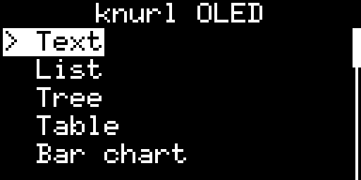
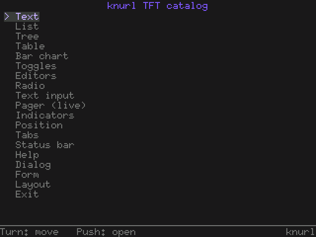
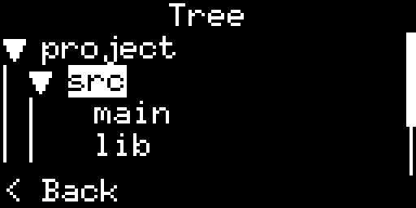
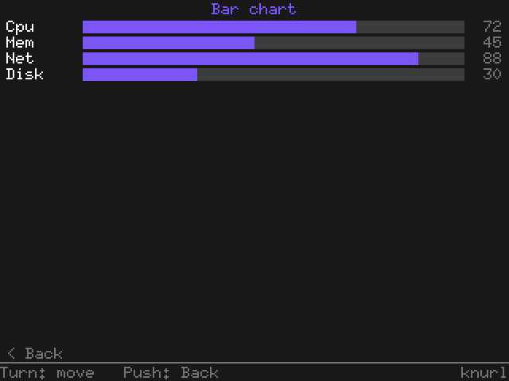
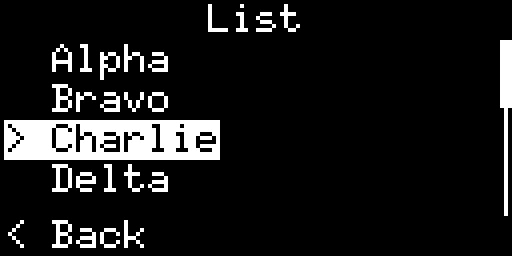
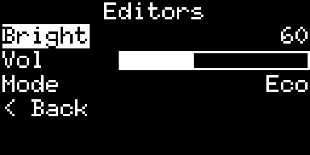
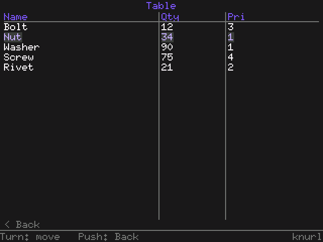
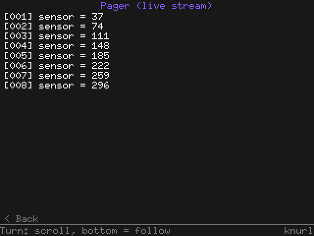

# knurl

**A grippy little TUI for embedded displays.**

`knurl` is a **pixel-native, `no_std`, allocation-free** TUI library for small
panels - OLED and TFT modules driven by microcontrollers like the RP2040. It
wears a [Bubble Tea](https://github.com/charmbracelet/bubbletea) / Charm-inspired
look (rounded chrome, a `>` cursor, an accented selection, dim everything else)
and is driven by a **rotary encoder with one button**. The guiding idea: *your
screen is a terminal* - a compact catalog of stack-only widgets, laid out in
pixels, that feels like a TUI on a 128×64 OLED.

<table>
<tr>
<td align="center"><b>OLED - 128×64 mono</b></td>
<td align="center"><b>TFT - 320×240 colour (Charm theme)</b></td>
</tr>
<tr>
<td></td>
<td></td>
</tr>
<tr>
<td></td>
<td></td>
</tr>
</table>

## The one idea worth knowing

Widgets draw onto an abstract `RenderTarget` and react to `Msg`s. They never know
what's behind the target - a real panel or a simulator window. That single seam
is what makes this true:

```
            ┌──────────────────────── the same Component code ───────────────────────┐
 firmware:  panel driver (SSD1306, ST7789, …)  →  Graphics/ColorGraphicsTarget  →  screens
 desktop:   SimulatorDisplay<BinaryColor|Rgb565> →  Graphics/ColorGraphicsTarget  →  screens
            └────────────────────────────────────────────────────────────────────────┘
```

`SimulatorDisplay` is already an `embedded-graphics` `DrawTarget`, and the
`GraphicsTarget` (mono) / `ColorGraphicsTarget` (colour) adapters are generic over
any such target - so the **simulator adds no new render path**. Screen code that
runs on hardware runs on your desktop, pixel-for-pixel.

The library is genuinely `no_std` and bare-metal portable - the machine proof:

```sh
rustup target add thumbv6m-none-eabi
cargo build -p knurl-core     --target thumbv6m-none-eabi
cargo build -p knurl-graphics --target thumbv6m-none-eabi
```

## Input model - a rotary encoder with one button

The target hardware is a **rotary encoder + push button**, so UIs are driven by
exactly three inputs and nothing else:

- **↑ / ↓** - rotate the encoder (move the cursor / change a value)
- **Space** - push the encoder button (select / edit / activate)

There is no Back, Left/Right, or text key - the device has none. **"Back" is a
selectable menu item**, never baked into a widget's data; the root menu's
**"Exit"** item asks the host to quit. The simulator reserves no quit key (Esc
does nothing); close the window (or pick "Exit") to leave.

## Architecture

knurl is **pixel-native**: there is no character grid. Coordinates and extents are
pixels (`Area` is `u16`), and widgets lay text out by asking the target for three
font metrics - `line_height()`, `char_width()`, `text_width(s)` - then positioning
glyphs by pixel. (Char-LCDs like the HD44780 are **out of scope**; knurl is
pixel-only.)

- **Semantic styling, per-target rendering.** A widget says *what* a piece of text
  is (`Style::{Normal, Accent, Muted, Danger, Focus, Inverted}`), never *how* to
  colour it. Each target decides: the mono `GraphicsTarget` maps styles to a 1-bit
  `Theme` (inversion / emphasis), the colour `ColorGraphicsTarget` maps them
  through a Charm `ColorTheme` (calm lilac selection, accented text, smooth bars -
  no hardcoded RGB). Semantic primitives like `draw_check` / `draw_radio` /
  `draw_bar` / `draw_spinner` let each target pixel-draw a real indicator.

- **DataProvider models.** Data-heavy widgets borrow a trait, not a fixed slice, so
  an app can back them with its own store (a fixed array, a ring buffer, generated
  rows) with no copying: `ListModel`, `TreeModel`, `TableModel`, `BarChartModel`,
  and `LinesModel` (the `Pager`, with a `write_line` variant for streaming data
  that is never stored whole). A plain `&[&str]` (etc.) still works via blanket
  impls.

- **Navigation - `Router` / `Nav`.** A fixed-depth, heap-free screen-history stack
  (`Router<Id, DEPTH>`): `push`/`pop`/`replace`, `current()`, `at_root()`. The app
  matches on `router.current()` to render a screen; a focusable "Back" item pops;
  "Back at the root" is the cue to exit.

- **Dirty + partial redraw.** Each `Component` carries a `Cell`-backed dirty flag
  set in `update()` only when state actually changes. The render loop *gates* on
  it: a frame with nothing dirty is skipped entirely, and a widget's `view()`
  self-clears and repaints **only its own area** - there is no global per-frame
  `clear()`. On a 320×240 panel a full repaint is ~150 KB over SPI, so animating
  one widget (a `Spinner`, a streaming `Pager`) repaints a few hundred bytes
  instead of the whole frame. (The win is hardware-measured; the simulator shows
  the gating.)

- **Desktop simulator (`knurl-sim`).** Mono and colour backends over
  `embedded-graphics-simulator`, sharing one event/render loop, plus the demos.

## Component catalog

Text & chrome: **Label**, **Title**, **Separator**, **Spacer**, **StatusBar**,
**Help**, **Dialog**, **Tabs**.
Data: **List**, **Tree**, **Table**, **BarChart**, **Pager** (with follow/tail).
Inputs: **Checkbox**, **Toggle**, **Counter**, **Slider**, **Picker**, **Radio**,
**TextInput**, and **Form** (a focus/edit-mode controller over `FormField`s).
Indicators: **Spinner**, **ProgressBar**, **LineGauge**, **Scrollbar**,
**Paginator**.
Layout: **VStack** / **HStack** (with `Constraint`), **Padded**, **Bordered**.

## Demos

Two **per-target** examples in `knurl-sim`, each a **full component catalog** tuned
to its screen (not a shared layout), opening at a `Router` menu. Encoder model
throughout; every page either fits or **scrolls** (lists/tree/table/pager scroll
themselves; row pages scroll with a `Scrollbar`) - nothing is truncated. Both run
on the dirty-gated partial-redraw loop.

- **`oled`** - monochrome, tuned for a tiny SSD1306 (128×64 default; `128x128` via
  arg). Compact chrome for ~5 rows.
- **`tft`** - colour, 320×240 ST7789-class, the default Charm `ColorTheme`, with a
  persistent status-bar hint and a **realtime `Pager`** page: a ring-buffer
  `LinesModel` that gains a line every few ticks (standing in for live UART), in
  follow/tail mode.

<table>
<tr>
<td></td>
<td></td>
</tr>
<tr>
<td></td>
<td></td>
</tr>
</table>

## Running the simulator

The desktop backend needs SDL2:

```sh
# macOS (Homebrew)
export LIBRARY_PATH="/opt/homebrew/lib:$LIBRARY_PATH"
export PKG_CONFIG_PATH="/opt/homebrew/opt/sdl2/lib/pkgconfig:$PKG_CONFIG_PATH"
# Debian/Ubuntu: sudo apt install libsdl2-dev

cargo run -p knurl-sim --example oled              # mono OLED, 128×64 (default)
cargo run -p knurl-sim --example oled -- 128x128   # mono OLED, taller variant
cargo run -p knurl-sim --example tft               # colour TFT, 320×240
```

Controls everywhere: **↑/↓** rotate, **Space** selects; "Back"/"Exit" are menu
items; close the window to quit.

### Regenerating the screenshots

The README images are produced **headlessly** (no SDL window - it renders to an
off-screen display and writes PNGs), so it works in CI:

```sh
cargo run -p knurl-sim --features desktop --example screenshots   # → docs/*.png
```

## Workspace layout

| Crate | `no_std` | Depends on | Role |
|-------|:--------:|------------|------|
| [`knurl-core`](knurl-core)         | ✅ (zero-dep) | - | Traits (`RenderTarget`, `Component`), `Msg`, `Style`, `Area`, `Router`, models, and every widget. |
| [`knurl-graphics`](knurl-graphics) | ✅ | `embedded-graphics` | `GraphicsTarget` / `ColorGraphicsTarget` adapters + `Theme` / `ColorTheme`. |
| [`knurl`](knurl)                   | ✅ | core (+ optional graphics) | Facade re-exporting the public API. |
| [`knurl-sim`](knurl-sim)           | ❌ std | graphics + `embedded-graphics-simulator` | Desktop simulator (mono + colour) and the demos. |

`knurl-sim` is a workspace member but **excluded from `default-members`**, so a
plain `cargo test` from the root never needs SDL2.

## Testing

```sh
cargo test            # core + graphics widgets, host-side (no SDL2)
```

## License

MIT OR Apache-2.0.
